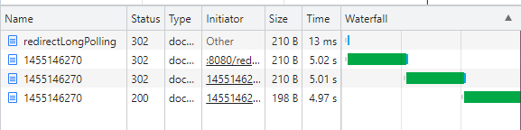

# Transforming service to long-polling

## Overview
In this tutorial, a way to transform a standard synchronous service to a redirect-based long-polled service. 
The example source uses Spring Framework but the transformation can be applied to solutions based
on other frameworks and languages too.

## Motivation
In the beginning given a service, which can serve requests fast (for example as it handles low amount of data)
and serves a relative small amount of clients. As time passes, it is a common phenomena, that both the number
of clients and the response time starts to grow.

In this case one of the possible changes to make is not to serve the requests in a synchronous way
anymore, but let the requests trigger asynchronous jobs. By this change, the client does not receive
the result data immediately, but only an identifier to the job and the client is free to pool the status
of the job anytime.

When this change is made it is worth to consider the impact on the clients: changing from one synchronous call
to a polling is a typical example of both service and client code changing (and gaining extra complexity).
Therefore, if the number of clients is high (or not even known, in the case of a public service) it might be
adequate to look for a way, which impacts only the service.

One of the possible ways can be introducing long-polling combined with HTTP redirects.

## State 0 - Synchronous service

As the initial status, consider the following synchronous service controller method:
```
@GetMapping
public BusinessObject getTheAnswer() {
    final BusinessObject result = businessService.doInternalCalculation();
    return result;
}
```
Let's assume, that the execution time of ```businessService.doInternalCalculation()``` grows as time passes by. 

At this stage the clients are simply firing a REST call to the endpoint of the service.
Invoking the example service (OriginalController), the network traffic pattern is simple:

<br/>

Only one REST call is being made, which return with HTTP 200 and result can be found in the response body.

## State 1 - Introducing long polling

As stated above, the main change is to let the service start (or even just queue up) a job upon a received REST call.
After this change, the controller's above presented method is changed and the controller gains a new method:

```
@GetMapping
public JobStatus getTheAnswer() {
    final Future<BusinessObject> futureResult = ... submit it to a task executor ...;
    final var id = ... assign an ID to the task ...;
    return JobStatus( ... which should contain ID at least, in this case ... );
}

@GetMapping("/{id}")
public JobStatus getJobStatus(@PathVariable int id) {
    final Future<BusinessObject> futureResult = ... find the job based on the id ...;
    final BusinessObject result = futureResult.get(... timeout ...) // Wait for result (but wait no longer as the defined timeout)
    
    // 1. If timeout happened
    return JobStatus( ... containing the fact, that the job is still running ... );
    
    // 2. If result is there
    return JobStatus( ... containing the business result ...);
}
```

Note the followings:
- The client has to adapt to use not only the first but also the new rest endpoint
- The client has to be aware of the structure of ```JobStatus```
- Based on the ```JobStatus``` attributes, the client has to poll for the result

This is also reflected in the network traffic pattern:
<br/>
The client had to fire up multiple requests against multiple endpoints. All the requests returned with HTTP 200, regardless whether the result is already available. 

## State 2 - Introducing redirects
In order to avoid leveraging the client with the points above, the service can utilise HTTP redirect responses.
To do so, the service shall change both the methods as follows:
```
@GetMapping
public RedirectView getTheAnswer() {
    final Future<BusinessObject> futureResult = ... submit it to a task executor ...;
    final var id = ... assign an ID to the task ...;
    return new RedirectView(... pointing to the other endpoint defined in this controller ...);
}

@GetMapping("/{id}")
public Object getJobStatus(@PathVariable int id) {
    final Future<BusinessObject> futureResult = ... find the job based on the id ...;
    final BusinessObject result = futureResult.get(... timeout ...) // Wait for result (but wait no longer as the defined timeout)
    
    // 1. If timeout happened
    return RedirectView(... pointing to this endpoint...);
    
    // 2. If result is there
    return result;
}
```
Note, that in this variant, the client - given that the REST client what is used, follows the redirects by default - has nothing to change in it's code.
The client does not have to introduce new DTOs (such as JobStatus in State 1), nor explicitly firing new REST calls.

The network pattern shows a different flow as in State 1.
<br/>
In this case, the client had to fire up one request which lead to a chain of redirects, which were followed automatically. HTTP 200 response arrives only when the actual business result is available. 

## Further notes
### About other possibilities
It is important to mention, that this solution should not be automatically preferred over performance optimization
(as it is common, that at beginning the new services are not optimised for response time) and scaling.
Still, in given circumstances (especially, when the use case enables longer response times) it can be valid
to prefer change to long-polling over performance optimization (which might mean a deep reworking of a complex logic)
and scaling (as that can lead to relevant increase of operation costs).

### About limitations
The idea behind the shown solution is based on two assumptions:
- that every network element is going support redirections (which might not be true in case of firewalls)
- that the client is going to follow redirections (which is a common default setting in most of the REST clients, but the service can not actually proof or enforce it)

### About architecture (direction of dependency)
Although, it is true, that in this way the service is gaining extra complexity in order to help the clients
adapt to the new way of communication (which means in best case, that the client has nothing to change at all),
the architecture is not changing in the manner of directions of dependencies. The service is still not going
to depend on the clients, just enabling them to hold less complexity.

### About HTTP Verbs
In the example above, we could point out, that in Stage 1 and 2, a GET REST request leads to a new job submitted and administrated by the server,
which is not perfectly passing to HTTP GET anymore. The followings should be still taken into consideration:
- it is true, that the technical state of the service has changed, still the business state has not (at least, given that the actual business process does not change the business state)
- the usage can be and should be idempotent: the server should recognise the case when two request with the same business meaning have arrived and should not queue the second task
    - this would also give a performance benefit for all the clients which are requesting something which is already on the way of being calculated
    - this also decreases the load on the server as the same process will not be triggered twice

## Conclusion
As a conclusion we can state, that the demonstrated way can free the clients of applying any change as well as can potentially 
lead to better average response times and lower server utilization (by avoiding running the same flow multiple times).